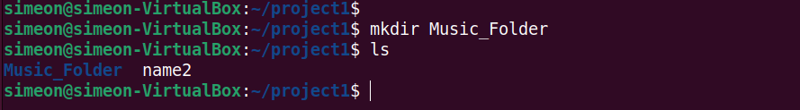
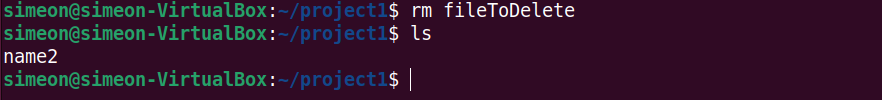

# Linux Practice Project

## A project on how to run basic linux command on Ubuntu terminal 

Before running ubuntu on window machine, you have to download and install the following 

* VirtualBox : An open-source software for visualization (It allows us to run operating systems ontop of our window machine) 

* Ubuntu Desktop : An ubunto operating system 

First install VirtualBox, you can download it using this link : https://www.virtualbox.org/wiki/Downloads

After installing the virtualBox successfully, start the virtualBox and install the downloaded ubuntu image.

You can dowload Ubuntu using this link : https://ubuntu.com/download/desktop

After installing Ubuntu successfully and starting it. Open terminal and run the following commands.

Open Ubuntu terminal and run the following commands..

* ### sudo apt upgrade

Sudo command let you perform task that require administrative or root permission 

* ### pwd command

Use the pwd command to find the path of your current working directory

* ### ls command

* ### cd command

Use the cd command to navigate through the Linux files and directories 

* ### cat command

Concatenate or cat command, its is use to list, combine, and writes file and content to the standard output.

* ### cp command 

Use the cp command to copy files or directories and their content.

* ### mv command

The primary use of the mv command is to move and rename directories

* ### mkdir command

Use the mkdir command to create one or multiple directories at once and set permissions for each of them.

* ### rmdir command

Use rmdir command to permanently delete an empty directory. The user should have sudo privileges

* ### rm command

The rm command is used to delete files within a directory 

* ### touch command

The touch command allows you to create an empty file or generate and modify a timestamp

* ### locate command 

Locate command can find a file in the database system

* ### find command 

Use the file command to search for a file within a specific directory 

* ### df command

Use the df command to report the system's disk space usage. use -h to get a more human output.

* ### du command

Use the du command to check how much space a file or directory takes. use the command to identify which part of the system uses storage excessively. Note : You must specify the path to the directory

* ### head command

The head command allows you to view the first ten lines of a file.

* ### tail command

The tail command displays the last ten lines of a file 

* ### diff command

Short for difference, the diff command compares two contents of a file and displays the parts that do not match after analyzing them

* ### chmod command

chmod is a command that modifies a file or directory's read, write and execution permission. Note : Each file in Linux is associated to three user classes. owner, group and others.

* ### ping command

The ping command is for checking whether a network is reachable and also used for troubleshooting variuos issues.

* ### uname command

This command will print detailed information about your Linux system and hardware

* ### history command

With history, the system will list too 500 previously executed commands.

