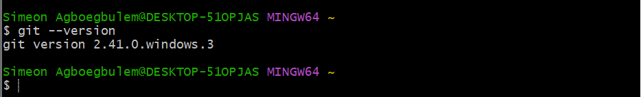
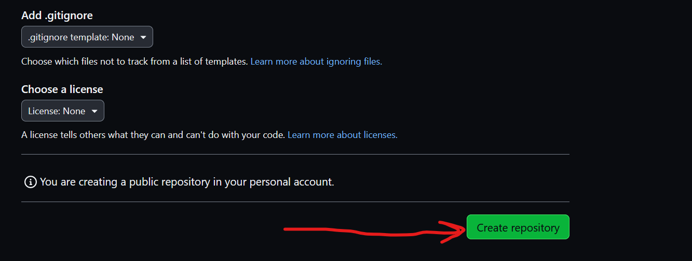

# GIT PROJECT

## Initializing a Repository and Making Commits 

Before installing and initializing a git repository let's first understand what git is.

### What is Git..
Git is a distrubuted version control system.

It allows developers make their own copy of the main repository, hence it is refered to as a distributed version control system.

it essentially solved the problem of sharing source code efficiently and keeping track of changes made to source code. 

### Installing Git
Click on this [Install Git](https://git-scm.com/downloads) and choose your operating system. weather Mac, Linux or Window 

 After a successful installation, search for git bash on you computer or just open the regular command line.

git --version : This command shows the version of git 
                installed on your computer 

### Initializing a Repository
Now follow these steps to initialze a git repo

On your terminal, create a working directory and navigate to that directory.

#### mkdir command

Use this command to create your work directory. Example mkdir DevopsProject 

#### cd command

Use the cd command to navigate to the working directory you created

#### git init command

Use git init to initialize your working directory 

### Making My First Commit

Navigate to your working directory 

Before creating and commiting my files, it is important to note that in git we have three environments

#### WORKING FILES

This is where all the changes are done. Eg : Developers modifying their code

#### STAGING 

This is the holding environment where your file seats until you are ready to commit them. 

#### COMMIT 

This is your final holding point before pushing to GitHub

Note : Files can be modified, unstaged and uncommited in your working directory before pushing to github.

### Follow the following steps to make your first commit

#### touch command

* Run the touch command to create a file inside your working directory 

#### ls command 

* Run the ls command to list your directory to make sure your file was successfully created

* Open your file using vs code and write any sentence then save changes 

#### git status command

After modifying run git status to get the status of you file 

You can see from the image above that git is not tracking your file because you have not addded the file to staging 

#### git add index.html

Run this command to add your file to staging. 

Note : if you have more than one file to add use
#### git add . command

#### git status command

Git is now tracking your changes, next we commit it

#### git commit command

Run the git commit command to commit your files 

### Working With Branches

Git branch help you create a different copy of your source code. You can make changes as you please in your new branch because it is independent of your main branch 

One of the reason for git branch is to develope new features and its also an important tool for colaboration within a remote teams working from different location 

### Creating my Branch

#### git branch dev

Switch to new branch 

#### git switch dev

List all the branches 

#### git branch 

Make changes to the branch and commit the changes 

#### git commit -a -m  Your Commit Message

Switch back to tha main branch 

#### git switch main

Merge into the main branch 

#### git merge -m Your Merge Message

Delete the dev branch 

#### git delete -d dev

#### git branch 

## Collaboration and Remote Repositories

Now that the local repository have been created, its time to push the file or code to git hub so that it can be available for other developers to access over the internet. 

Remote teams can now view, update and make changes to the same repository 

### Creating a GitHub Account 

Click here [github](https://github.com) to register 

Follow the steps on the website to register

### Creating a Repository

* Click on the plus sign at the top right coner of you git hub account 

* Fill out the form by adding a unique repository name, discription and ticking the box to add a readme file 

* copy your repository link 

* Add your remote repository to your local repository using the command below 

#### git remote add origin <"paste the link you cpoies">

#### git push origin main 

#### git clone <"paste your remote repository link">

THANK YOU

