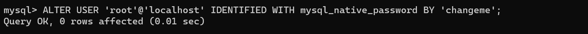
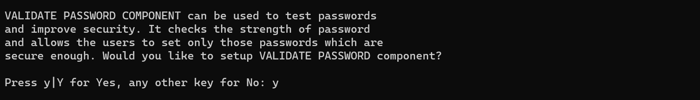

# WEB STACK IMPLEMENTATION (LAMP STACK) IN AWS

To implement this project we are going to leverage on AWS EC2 (Elastic Compute Cloud) virtual machine to install Ubuntu. 

Click on [Create Account](https://portal.aws.amazon.com/billing/signup?type=enterprise#/start/email) to create your aws account 

Watch the videos below to create up your AWS account, set up Ubuntu server and connect to your instance from your terminal 

[Create AWS account and set up Ubuntu server](https://portal.aws.amazon.com/billing/signup?type=enterprise#/start/email)

[Connect to your EC2 Instance from your terminal](https://www.youtube.com/watch?v=TxT6PNJts-s&list=PLtPuNR8I4TvkwU7Zu0l0G_uwtSUXLckvh&index=8)

NOTE : Save you private key. ie (the .perm file you downloaded from AWS while setting up your instance) in a secure location on your machine and don't share it with anyone. If you lose it, you will not be able to connect to your server again.

### Connect to your instance from the terminal 

. open AWS, select the instance you created and click on connect

. copy the the ssh command, cd into the folder where you downloaded your AWS ssh key and paste it in your terminal 

#### ssh command : 
ssh -i "<"your-private-key-name">.pem" ubuntu@<"public-ip-address>.compute-1.amazonaws.com

 

Congratulation!!! you have successfully connected to your EC2 instance from your window terminal.

 

Note : You are the user connecting from you terminal to the EC2 instance you created on AWS

Kindly read about AWS [free tier limits](https://aws.amazon.com/free/?all-free-tier.sort-by=item.additionalFields.SortRank&all-free-tier.sort-order=asc&awsf.Free%20Tier%20Types=*all&awsf.Free%20Tier%20Categories=*all) and make sure to alway stop your EC2 instance when you are not using it.

Just keep in mind that we have 750 hours (31.25 days) of t2.micro server per month for the first one year FOR FREE

Things to Note
---
* You can launch and stop new instances when you need to, but by default there's a soft limit of 5 running nstances at the same time. 

* When you stop an insatance it stops consuming available hour

* Every time you stop and start your EC2 instance, you will have a new ip address. dont forget to update your ssh credentials when you try to connect to your EC2 server.

---

### Installing Apache and Updating the Firewall

This steps will show how to configure your EC2 instance to serve as a web server, but before we dive into configuaration let's understand what a web server is.

#### Web Server :
A web server is software and hardware that uses HTTP (Hypertext Transfer Protocol) and other protocols to respond to client requests made over the World Wide Web. 
[ReadMore](https://www.techtarget.com/whatis/definition/Web-server)

#### Apache : 
Apache is a free and open-source software that allows users to deploy their websites and other applications on the internet. It is one of the oldest and most reliable web server software maintained by the Apache Software Foundation, with the first version released in 1995. [ReadMore](https://httpd.apache.org/) However, websites and other application can run on other web servers software as well. Such as [Nginx](https://www.nginx.com/), [IIS](https://www.iis.net/), etc

Installing Apache using ubuntu's package manager apt 

Read about apt [apt](https://en.wikipedia.org/wiki/APT_(software))

#### sudo apt update : 
Run this command to update 

#### sudo apt install apache2 : 
Run this command to install apache2

sudo systemctl status apache2 : 

Run his command to check status of your install apache web server

If its green and running then your web server was installed correctly. Now let launch our web server in the cloud!. 

But before we launch let's first configure our TCP port to listern to port 80 which is the default port for web browsers to access web pages on the internet.

Recall that we have TCP port 22 open by default on our EC2 machine to access via SSH, so we need to add another rule to the EC2 configuration to open inbound connection through port 80 

* Open your EC2 instance on AWS 
* Select the instance you want and click on security 
* Select your security group 
* Select Inbound rules 
* Select edit inbound rules
* click on add rule
* select HTTP and in the custom column select the defaul source and click save 

Source 0.0.0.0/0 means we can access it from any ipaddress. 

#### curl http://localhost:80 
Run this command to see if you can access the web address locally on ubuntu shell 

#### curl -s http://169.254.169.254/latest/meta-data/public-ipv4

Run this command to retrive your public ip-address from you running EC2 instance 

Open your browser and run http://<"your public Ip-Address">:80 

If you see the below image then your web server is correctly installed and accessable through your firewall.

### Installing Mysql

Now that i have a web server up and running, i will install a [Database Management System](https://en.wikipedia.org/wiki/Database#Database_management_system) (DBMS) to be able to store and manage data for the site.

MYSQL is a popular relational database management syatem used within PHP environments, so we will use here.

!Reminder... Use 'apt' to acquire and install software. 

#### sudo apt install mysql-server
Run this command to install MYSQL Server, when prompted select Y and hit enter 

After successful installation log into MYSQL console 

#### sudo mysql 
Run this command to log into mysql console. This will connect the Mysql server as the Administrative database user (root) which is inferred by using sudo when running this command.

NOTE : It is recommended that you run a security script that comes pre-installed with MSQL. This script will remove some insecure default settings and lock down access to your database system. Before running the script you will set a password for the root user using mysql_native_password ad the default authentication method.

#### ALTER USER 'root@'locahost' IDENTITY WITH mysql_native_password BY 'Enter the password you want to set'; 

Run this command to set your password

#### exit 
Run this command to exit MYSQL Shell

Now start the interactive script by running the command bellow 

#### sudo mysql_secure_installation

This will ask if you want to configure the VALIDATE PASSWORD PLUGIN? just accept by typing Y and hit enter

You will be prompted to select the password level 

What you select will determine the strength of the password you will set 

You will then be prompted multiple times. just select Y for the rest of the questions and hit enter 

When done, test to see if you will able able to log into MYSQL console 

#### sudo mysql -p

Note : the -p flag command will prompt you for the password used after changing cthe root user password. 

Notice that you have to provide a password to connect as root user. 

SIDE ADVICE! : 

For increased security, it is better to have dedicated user account with less expansive privileges set up for every database, especially if you plan to have multiple database hosted on your server 

Congratulations!!!  your mysql server is now installed and secured.

### Installing PHP
Note 
---
1. You have Apache installed to serve your content

2. MYSQL installed to store and manage data

What is PHP ?

[PHP](https://www.php.net/) is the componet we need in our setup to process the code to display dynamic content to the end user.

We will use a package : php-mysql a PHP module that that allows PHP to communicate with MYSQL-based database.

You will also need libapache2-mod-php to enable Apache to handle PHP files.

Core PHP Packages will automatically be installed as dependencies

---

Note you can install this three packages at once just run the command bellow 

#### sudo apt install php libapache2-mod-php php-mysql 

#### php -v 
Run this command to check the version of php that is installed 

At this point your LAMP Stack is completely installed and fully operational 

* &#x2611; Linux (Ubuntu) 
* &#x2611; Apache HTTP Server
* &#x2611; MYSQL 
* &#x2611; PHP

To test your setup with a PHP script its best to set up a proper [Apache Virtual Host](https://httpd.apache.org/docs/2.4/vhosts/) to hold your website files and folders.

Virtual host allows you to have multiple websites located on a single machine and user of the website will not even notice it.

Now let's configure our first virtual host 

### Enable PHP on the Website 

IMPORTANT TO NOTE!!!

with the default directory index setting on Apache, index.html will always take precedence over an index.php file. 

This is useful for setting maintenance pages in PHP application, by creating a temporary index.html file containing an informative message to visitors.

Because this page will take precedence over the index.php page, it will then become the landing page the application.

Once maintenance is over, the index.php is renamed or removed from the document root, bringing back the reguar application page.

You can chose to change the behaviour by editing the etc/apache2/mods-enabled/dir.conf file and change the order in which the index.php file is listed within the directory index directive 
.

sudo vim /etc/apache2/mods-enable/dir.conf

Note : the above command will try to create the file if it does not exist but you might run into problem especially if you are using a newer version of php. 

If you run into problem just follow this steps to resolve it. 

### Posible Errors 
* Vim not found 

#### sudo apt install vim 
Run the command to install vim 

* Can't open file for writing 

#### Posible Courses 
* File permission 
* File Lock 
* File is readonly 

Follow this steps to resolve the issues 

#### sudo apt update -y
Run this command to make sure your apps are up to date

If it prompt you to upgrade, just accept and upgrade or use the command 

#### sudo apt upgrade

#### sudo add-apt-repository ppa:ondrej/php -y
Run this command to install php repository 

#### sudo service apache2 status 
Run this command to check the status of your apache server, if it not running run this command to start it 

#### sudo systemctl start apache2 

Next : 

Navigate into this directory and use the below command to rename your default index.html file
#### cd /var/www/html

#### sudo mv index.html index-old.html
Run this command to rename your file

#### touch index.php 
Run this command to create your php file, and open the file in vim 

#### vim index.php

Add this line of  code <"?php phpinfo(); ?> and save. 

Refresh you brower and there you have it 

This page provides information about your server and it useful for debuging

You can remove the index.php file or simply rename it

Conclusion : Challenging for fun! 

Thank you for reading 

