# WEB STACK IMPLEMENTATION (LAMP STACK)

To complete this project you will need an AWS account and a virtual server with Ubuntu Server operating system. 

Start your instance and ssh into you ubuntu instance 

#### ssh -i < Your-private-key.pem> ubuntu@< public-IP-address>

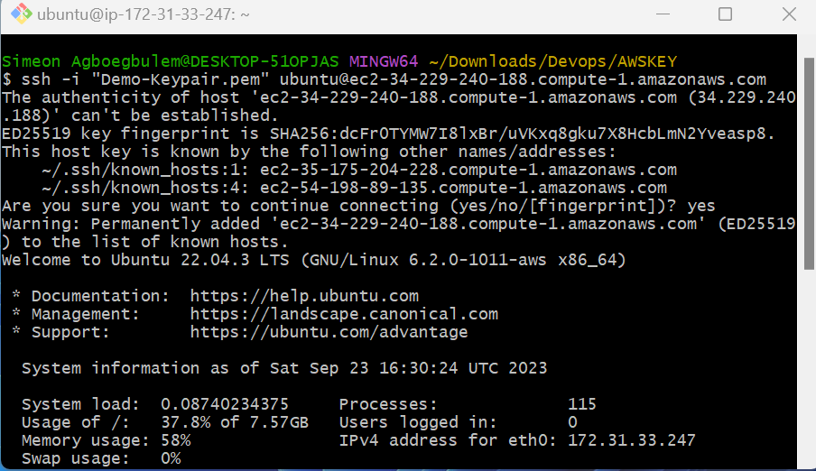
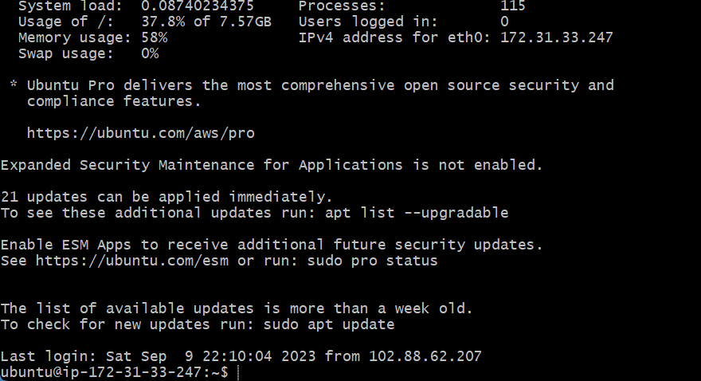

### INSTALLING  NGINX SERVER

For us to display our web page to our site visitors, we will use nginx as the host server

NGINX is open source software for web serving, reverse proxying, caching, load balancing, media streaming, and more. It started out as a web server designed for maximum performance and stability. In addition to its HTTP server capabilities, NGINX can also function as a proxy server for email (IMAP, POP3, and SMTP) and a reverse proxy and load balancer for HTTP, TCP, and UDP servers.

!Important : Always update your server packages before installation, this will ensure that you you have the latest security update.

#### sudo apt update 

Run this command to update your server 

#### sudo apt-get install nginx

Run this command to install NGINX server on your ubuntu instance 

When propmpted enter Y to confirm you want nginx to install OR you can use -y when running the command if you dont want to be prompted. 

#### sudo systemctl status nginx

Run this command to check nginx status 

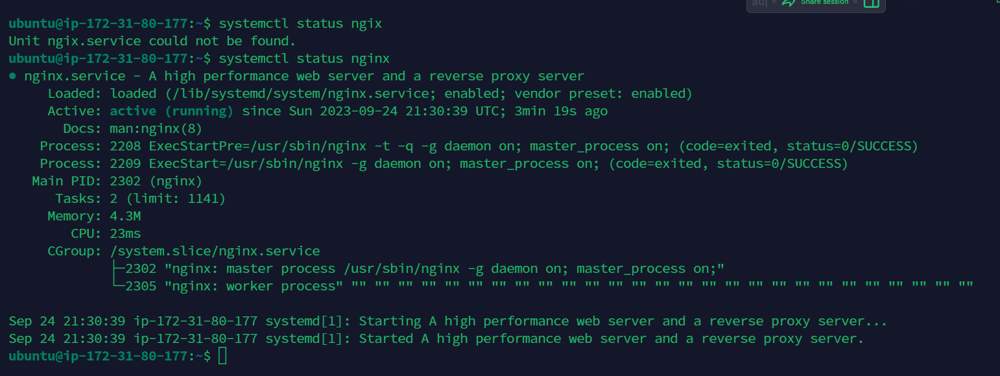

Note: Before our web server can receive any traffic, we need to configure it to listern to port 80, which is the default port that web browsers use to access web pages on the internet

Remember! Transmission Control Protocol (TCP) port 22 open by default on our EC2 instance.
To connect via ssh we need to add a rule to EC2 configuration to open incound connection through

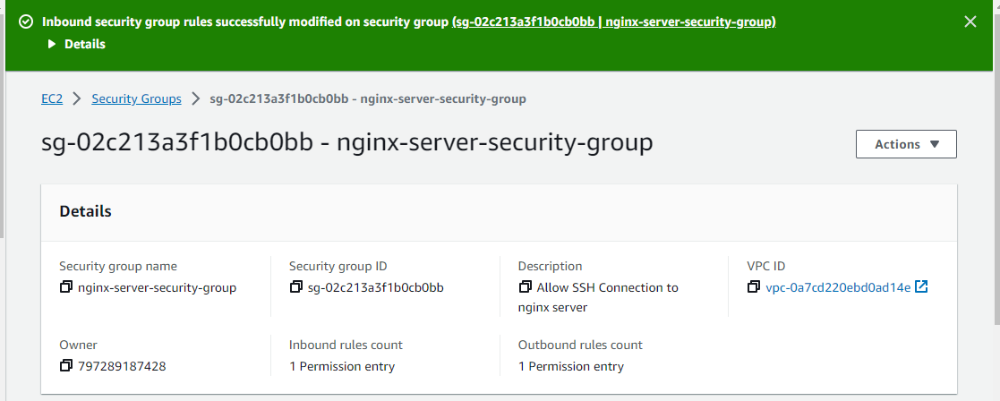

Now that our server is running we can access it both locally and over the internet

#### curl http://localhost:80 

Note : Source 0.0.0.0/0 : This means accept traffic from any ipaddress. 

Now check to see that you can access it locally in our ubuntu shell 

#### curl http://localhost:80 

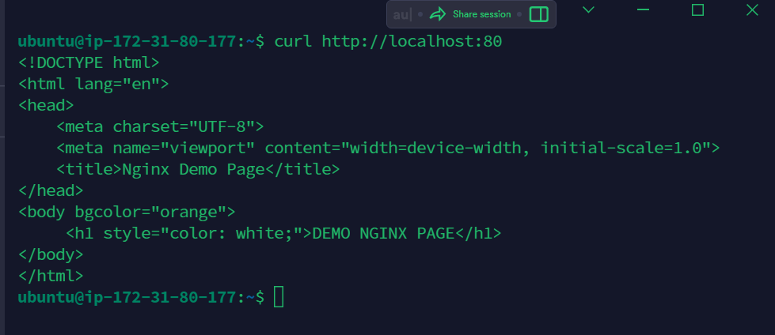

Now that we can access nginx locally, let's also test how our ngixn server can respond to request from the internet.

To check, open any browser of your choice and try to access the following url 

#### http://< public-IP-address>:80 

Note : The public ip address is your EC2 instance public ip address 

You can retrive it using this command 

#### ip a 

Run this command to see your instance public ip address 

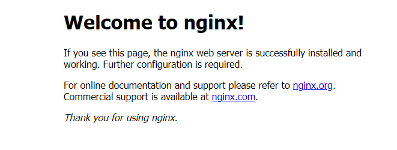

### INSTALLING MYSQL 

Now that i have a web server up and running, i will install a [Database Management System](https://en.wikipedia.org/wiki/Database#Database_management_system) (DBMS) to be able to store and manage data for the site.

MYSQL is a popular relational database management syatem used within PHP environments, so we will use here.

#### sudo apt install mysql-server -y 

After successful installation....

#### sudo mysql 

Run this command to connect to MySQL Server as the administrative database user root.

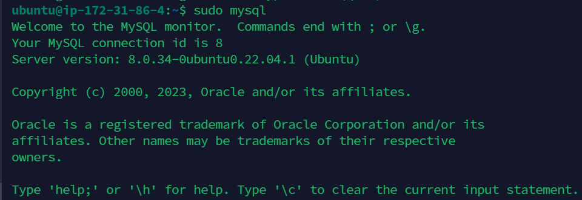

NOTE : It is recommended that you run a security script that comes pre-installed with MSQL. This script will remove some insecure default settings and lock down access to your database system. Before running the script you will set a password for the root user using mysql_native_password ad the default authentication method.

#### ALTER USER 'root@'locahost' IDENTITY WITH mysql_native_password BY 'Enter the password you want to set'; 

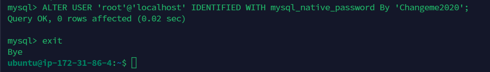

#### exit 
Run this command to exit MYSQL Shell

Now start the interactive script by running the command bellow 

#### sudo mysql_secure_installation

This will ask if you want to configure the VALIDATE PASSWORD PLUGIN? just accept by typing Y and hit enter

Note : If you enable this feature, and provide a password that does not meet MySQL specified criteria, it will be  rejectedby MySQL with an error. It is safe to leave validation disabled but you should always use strong unique password for your database credentials.

So when prompted, answer Y for yes, or anything else to continue 

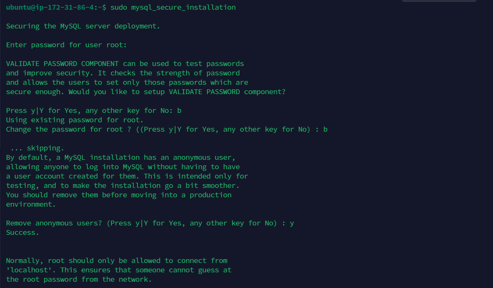

For the rest of the question press Y and hit enter, this will prompt you to change the root password, remove anonymous users and the test database, disable remote root logins and load new rules so that MySQL will immediately respect the changes you have made.

To test if you can login to MySQL console, Run the command below 

#### sudo mysql -p 

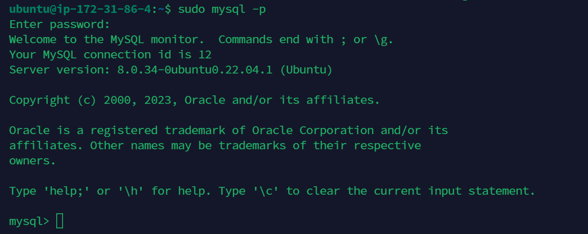

The -p flag in this command will prompt you to enter the password used after changing the root user password
ie if you changed it.

#### exit 

Run this command to quit MySQL console 

### Important!!

For increased security, it is best to have a dedicated user account with less expansive privileges set up for every database, especially if you plan on having multiple database on your server 

Now that our MySQL installation is complete, we will install PHP, which is the final component in the LEMP stack

### INSTALLING PHP 

---
1. You have Nginx installed to serve your content

2. MYSQL installed to store and manage data

What is PHP ?

[PHP](https://www.php.net/) is the componet we need in our setup to process the code to display dynamic content to the end user.

Why Apache enbeds the PHP interpreter in each request, Nginx requires an external program to handle PHP processing and act as a bridge between PHP interpreter itself and the web server. This allows for a better performance in most PHP based websites but it requires additional configuration. You will need to install : php-fpm , which stands for "PHP fast CGI process manager", and tell Nginx to pass PHP rqquest to this software for processing. Additionaly, you will need php-mysql, a PHP module that allows PHP communicate with MySQL based database.

Core PHP Packages will automatically be installed as dependencies

---

#### sudo apt install php-fpm php-mysql

Run this command to install the two packages 

#### sudo apt install php libapache2-mod-php php-mysql 

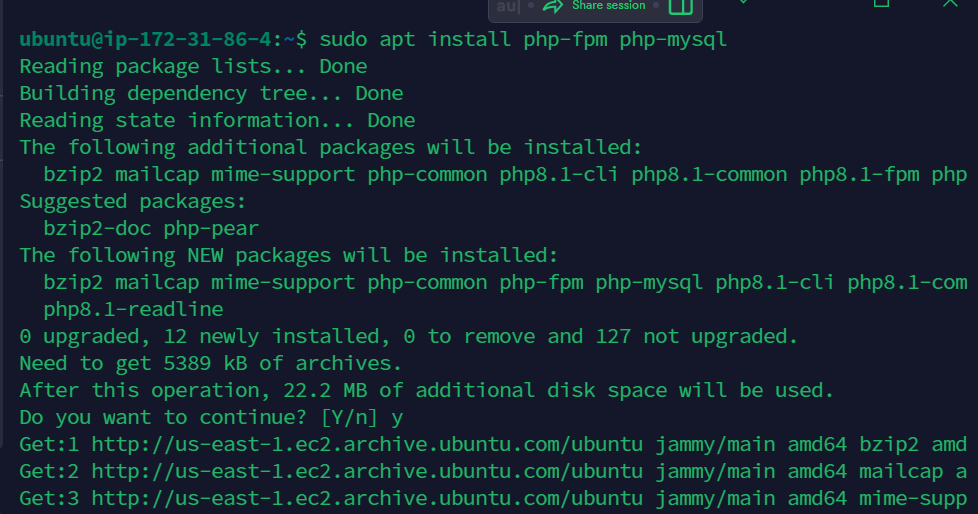

#### php -v 
Run this command to check the version of php that is installed 

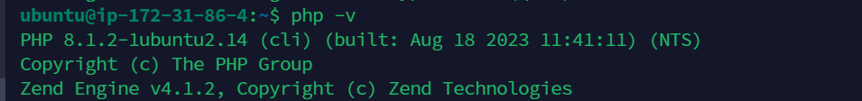

At this point your LEMP Stack is completely installed and fully operational 

* &#x2611; Linux (Ubuntu) 
* &#x2611; Nginx Server
* &#x2611; MYSQL 
* &#x2611; PHP

### Configuring Nginx to Use PHP Processor 

Note

When using the Nginx web server, we can create server blocks (similar to virtual host in nApache) to encapsulate configuration details and host more than one domain on a single server. for this i will use a demo project as an example domain name. 

On ubuntu 22.04 LTS, Nginx has one server block enabled by default and its configured to serve documents out of a directory at /var/www/html . While this works well for a sigle site, it can become difficult to manage if you are hosting multiple sites.

Instead of modifying the the default, it is recommended to create a directory structure within the /var/www for your domain website leaving /var/www/html in place as the default directory to be served if the client request does not match any other site.

STEPS...

. Create the root web directory for your domain

#### sudo mkdir /var/www/LempProject

image

. Assign ownership of the directory with with $USER environment variable, which will reference your current system user

#### sudo chown -R $USER:$USER /var/www/LempProject

//

. Open a new configuration file in Nginx sites-available directory using your prefarred command line editor. 

#### sudo vim /etc/nginx/sites-available/LempProject

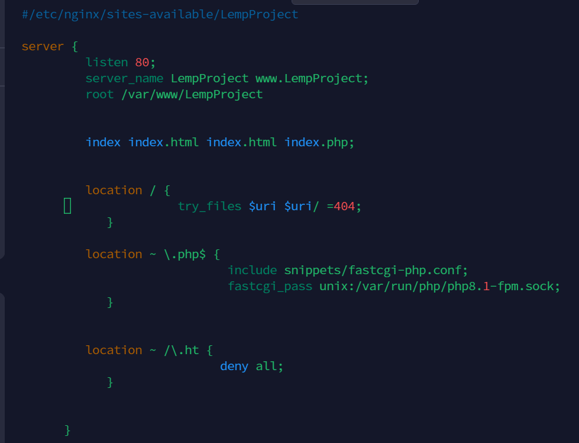

#### Discription of the above configuration...

* listen  - Defines what port Nginx will listen on. in this example we gave it port 80, which is the default port for HTTP

* root - Defines the document root where the files served by this website are stored 

* index - Defines in which order Nginx prioritize index files for this website. It is a common practice to list 
index.html files with a higher precedence than index.php files to allow for quickly setting up a maintenance landing page in PHP 
applications. You can adjust the seetings to suit your application need. 

* server_name - Defines which domain names and /or IP addresses this server block should respond for. Point this directive to your server's domain name or public IP address.

* location / - The first location block includes a try_files directive which checks for the exixtence of files or directories matching a URL request. If Nginx cannot find the appropriate resources, it will return 404 error, which is a status code meaning NOT FOUND!

* location ~ \\.php$ - This location block handles the actual PHP processing by pointing Nginx to the fastcgi-php.conf configuration and the php8.1-fpm.sock file, which declears what socket is associated with php-fpm

* location ~ /\\.ht - The last location block deals with .htaccess files, which Nginx does not process. By adding the deny all directives, if any style="color: red;">.htaccess files happen to find their into the document root, they will not br served to visitors. 

After Editing and saving your files, you can activate your configuration by linking to the config file from Nginx's sites-enabled directory 

#### sudo ln -s /etc/nginx/sites-available/LempProject /etc/nginx/sites-enable/

Run this command to tell Nginx to use the configuration next time it is reloaded.

You can test your configuration for syntax error by typing....

#### sudo nginx -t

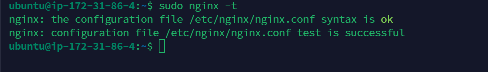

Note : If you get any error, review your configuration file

We also need to disable default Nginx host that is currently configured to listen on port 80, for this to run 

####  sudo unlink /etc/nginx/sites-enabled/default 

After that reload Nginx to apply the changes 

#### sudo systenctl reload nginx 

Run this command to reload Nginx 

Your website is now active but the web root /var/www/LempProject directory is still empty, Create an index.html file in that location so that we can test that your new server block work as expected 

#### sudo echo 'Helo LEMP from hostname' $(curl -s http://169.254.169.254/latest/meta-data/public-hostname) 'with public IP' $(curl -s http://169.254.169.254/latest/meta-data/public-ipv4) > /var/www/LempProject/index.html

Run this command to create and display your ec2 detailed, you can also navigate and create an index.html file and modify the file using your prefared code-editor 

Open your browser and enter your public IP

#### http://< public-Ip>:80201987

You can leave this file in place as a temporary landing page for your application untill you set up an index.php file to replace it.

NOTE : Once you do that, remember to rename or remove index.html file from your document, as it would take precedence over index.php file by default.

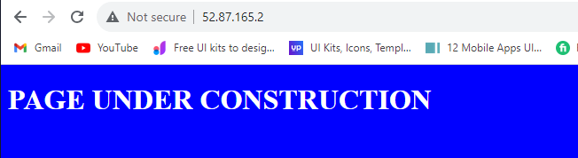

Your LEMP stack is now fully configured.

Next : We will create a PHP script to test that Nginx is in fact able to handle .php files within the newly configured website. 

### Testing PHP With Nginx

Now that our LEMP stack is completely setup and fully operational we will test to validate that Nginx can correctly handle .php files to PHP processor.

. Create a PHP file in your document root called info.php and open the file in your text editor.

#### sudo touch /var/www/LempProject/info.php

Run this command to create your info.php file

#### sudo vi /var/www/LempProject/info.php

Run this command to open in vim 

Add the below code 

<?php 

phpinfo(); 

Rename your index.html file to allow info.php take precedence.

#### sudo mv /var/www/LempProject/index.html index-old.html

You can now access this page in your web browser by visiting the domain name or your public IP address followe by /info.php

####  http://server_domain_or_IP/info.php

You will see a web page containing detailed information about your server

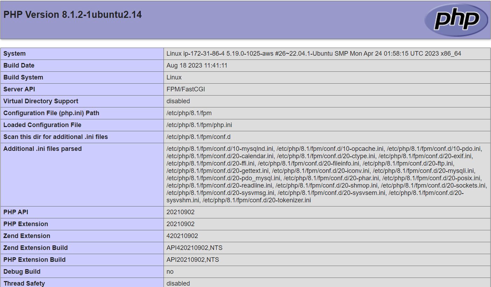

Note 

After checking the relevant information about your PHP server through this page, it is best to remove the file you created as it contains sensitive information about your PHP environment and your Ubuntu server 

sudo rm /var/www/LempProject/info.php

Run this command to remove info.php file and rename the temporary index.html file as a place holder

#### sudo mv /var/www/LempProject/index-old.html index.html

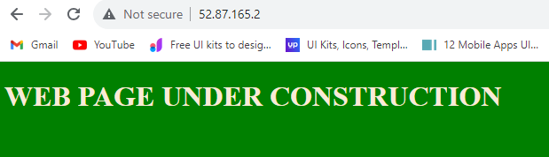

You can always regenerate this page if you need it leter

### Retrieving Data From MySQL Database With PHP

In this step you will create a test database (DB) with simple data and configure access to it, so the Nginx website would able to query data from the DB and display it. To achieve this we will create a database and a user 

First connect to the MySQL console using the root account 

#### sudo mysql 

#### CREATE DATABASE DemoLempDb;

Now you can create a new user and grant him access and full privileges on the database you have just created

#### CREATE USER 'test_user'@'%' IDENTIFIED WITH mysql_native_password BY 'password.1';

Now we need to give this user permission over the demoDb database

#### GRANT ALL ON demoDb.* TO 'test_user'@'%';

This will give the user full privileges over the assigned database, while preventing the user from creating or modifying other database on your server

Now exit MySQL shell with 

#### exit 

You can now login to MySQL console again with the credentials of the new user you created 

#### mysql -u user_name -p

Note 

The -p flag in this command will prompt you for the password used when creating the user.

#### SHOW DATABASES; 

Run this command to confirm you have access

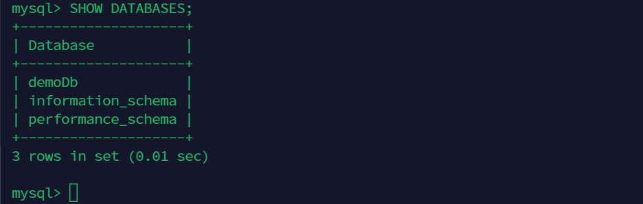

Next, we will create a test table from MySQL console 

#### CREATE TABLE demoDb.products (product_id INT AUTO_INCREMENT, product_name VARCHAR(200), product_price VARCHAR(200), PRIMARY KEY(product_id));

Insert few rows of product in the table.

#### INSERT INTO demoDb.products (content) VALUES ("HP Probook", "50000");

You may need to run this command multiple times to insert as many as you want 

To confirm that it was successfully saved to your table, run the below command to select all from your table 

#### SELECT * FROM demoDb.products;

You will see the following output...

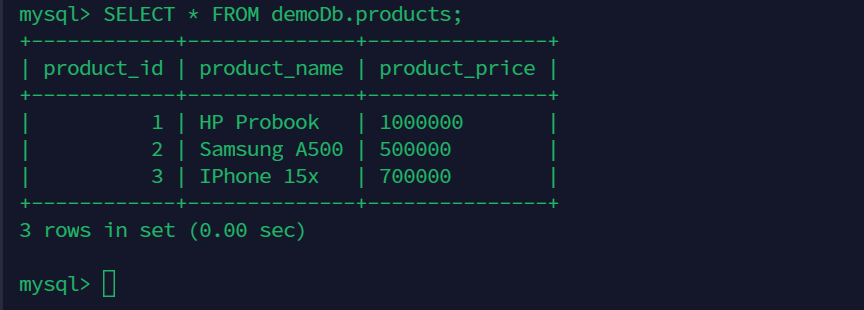

After confirming that you have a valid in your table, you can exit the MySQL console 

#### exit 

Next : Create a PHP script that will connect to MySQL and query for your content.

First create a new PHP file in your custom web root directory using your preferred editor. i will use vi

#### sudo vi /var/www/LempProject/products.php

Copy the below content into your file

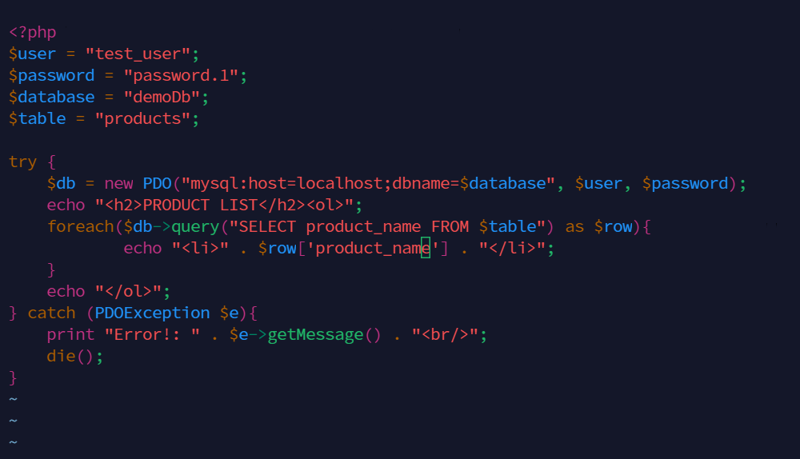

Open your browser and enter your ip address

####  http://server_domain_or_IP/product.php

You should see a page like this, showing the content you have inserted into the demoDb

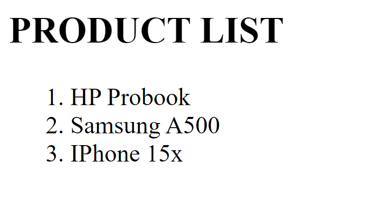

This means that Your PHP environment is ready to connect and interact with your Mysql server.

In this guide, we have built a flexable foundation for serving PHP websites and application to our site visitors, using Nginx as web server, and MySQL as database management system. 

