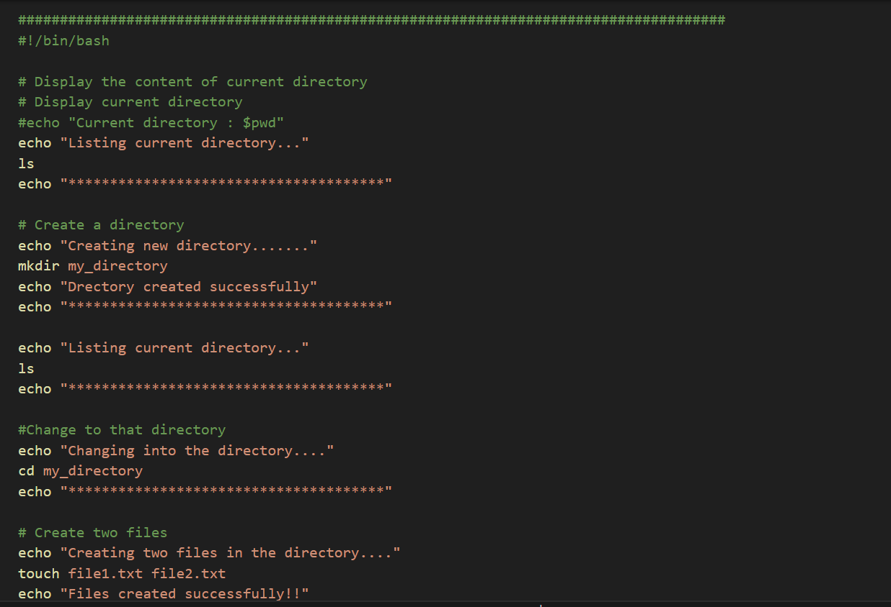
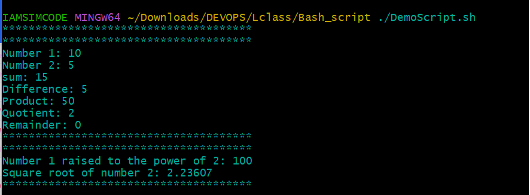

# SHELL SCRIPTING 

## Introduction to Shell Scripting and User Input 

Bash scripting is a series of command and instruction that are executed sequentially in a shell.

### Shell Scripting Syntax Elements 

1. Variables : Bash allows you to define and work with variables.  

Example : Assigning a variable 

#### NAME="boss"

Retrieving  a variable 

#### $NAME 

2. Control Flows : Bash provide cotrol flow statements (Conditionals, Loop and Case statement ) to control the flow of execution in your script.  These statements allows you to make decision, iterate over lists and execute commands based on condition. 

<button class="button" type="submit">Copy Below Code</button>

The piece of code prompts you to type a number and prints a statement stating if the number is positive
negative or zero.

#### FOR LOOP 
Iterating through a list using a for loop 

<button class="button" type="submit">Copy Below Code</button>

Run the above script and the result is 

NOTE : if you want your count to start from 1 instead of zero 

3. Command substitution : Command substitution allows us to capture the output of a command and use it as a value within the script. 

sample of how command substitution can be used in our script 

Get current date using backtick and $() 

<button class="button" type="submit">Copy Below Code</button>

4. Input and Output : Bash provides various ways to handle input and output, you can used the read command to accept input from user and output text to the console using echo command. Additionally, you can redirect input and output using operators like > (output to a file), < (input from file), and | (pipe the output of one command as input to another).

#### Accept user input

<button class="button" type="submit">Copy Below Code</button>

#### <code style="color : darkorange">echo "Enter your name: "</code>

#### <code style="color : darkorange">read NAME</code>

#### Output text to the terminal

<button class="button" type="submit">Copy Below Code</button>

#### <code style="color : darkorange">echo "Hello World"</code>

### Output the result of a command to a file 

<button class="button" type="submit">Copy Below Code</button>

#### <code style="color : darkorange">echo "Hello World" > index.html</code>

### pass the content of a file as input to a command

<button class="button" type="submit">Copy Below Code</button>

#### <code style="color : darkorange">grep "pattern" < input.txt.html</code>

### Pass the result of a command as input to another command 

<button class="button" type="submit">Copy Below Code</button>

#### <code style="color : darkorange">echo "hello world" | grep "pattern"</code>

5. Functions : Bash allows you to define and use functions to group related commands together. Functions provide a way to modularize your code and make it more reusable. You can define functions using the function keyword or simply by declearing the function name followed by parentheses. 

<button class="button" type="submit">Copy Below Code</button>

Execute the script :

Follow the following steps to create your first shell script

A. On your terminal, create a folder called shell_scripting 
### <code style="color : red">mkdir shell_scripting</code>

B. Creat a .sh file with a prefered name using the command 

### <code style="color : red">touch user_input.sh</code>

C. Inside the file you created copy and paste the block of code below 

<button class="button" type="submit">Copy Below Code</button>

Things to Note : 

### <code style="color : red">#!/bin/bash</code>
The above helps you specify the type of bash interpreter to be used to execute the script 

D. Run the command <code style="color : red">sudo chmod +x user_input</code> this will make the file executable

E. Run the script using the command <code style="color : red">./user_input.sh</code>

Additional Resources 

Click on the [Learn-Shell-Scripting](https://www.freecodecamp.org/news/bash-scripting-tutorial-linux-shell-script-and-command-line-for-beginners/) to learn shell scripting in an interactive environment 

## Directory Manipulation and Navigation 

Simple script to manipulate directory 

This script will display current directory, create new directory called my_directory, change to that directory, create two files inside, list the files, move back one level up, remove my_directory and its contents, and finaly list the files in the current directory again 

A. Open a file named fileSystem.sh 

B. Paste the code block below into your file 

<button class="button" type="submit">Copy Below Code</button>

C. Run the command <code style="color : red">sudo chmod +x fileSystem.sh </code> this will make the file executable

D. Run the script using the command <code style="color : red">./fileSystem.sh </code>

### File Operations and Sorting 

Simple shell script that focuseson file operation and sorting 

This script creates three files (file1, files2, file3), displays the files in their current order, sort them alphabetically, saves the sorted files in sorted_files.txt, display the sorted files, remove the original files, rename the sorted to sorted_files_sorted_alphabetically.txt, and finally display the content of the sorted file.

A. Open your terminal and create a file using the command <code style="color : red">touch DemoScript.sh</code>

B. Copy and paste the block of code below into the file

<button class="button" type="submit">Copy Below Code</button>

D. Run the command <code style="color : red">sudo chmod +x DemoScript</code> this will make the file executable

E. Run the script using the command <code style="color : red">./DemoScript.sh</code>

### Working with Numbers and Calculations 

This script defines two variables num1 and num2 with numeric values, perform basic arithemetic operations (addition, subtraction, multiplication, division and modu;lus), and displays the results. it also performs mre complex calculations such as raising num1 to the power of 2 and calculating the square root of num2, and displays those results as well.

A. Open your terminal and create a file using the command <code style="color : red">touch DemoScript.sh</code>

B. Copy and paste the block of code below into the file

<button class="button" type="submit">Copy Below Code</button>

D. Run the command <code style="color : red">sudo chmod +x DemoScript</code> this will make the file executable

E. Run the script using the command <code style="color : red">./DemoScript.sh</code>

### File Backup and Timestamping 

This script will focus on backup and timestamp. Backing up databases and other storage devices is one of the most common task as a devops engineer 

This script defines the source directory and backup directory paths. It then creates a timestamp using the current date and time, and creates a backup directory with the timestamp appended to its name. The script then copies all files from source directory to the backup directory using the cp command with the -r option for recursive copying. Finally, it displays a message indicating the completion of the backup process and shows the path of the backup directory with the timestamp.

A. Open your terminal and create a file using the command <code style="color : red">touch DemoScript.sh</code>

B. Copy and paste the block of code below into the file

<button class="button" type="submit">Copy Below Code</button>

D. Run the command <code style="color : red">sudo chmod +x DemoScript</code> this will make the file executable

E. Run the script using the command <code style="color : red">./DemoScript.sh</code>

Simple shell scripting implementation. for further study click the link below!

Click on the [Learn-Shell-Scripting](https://www.freecodecamp.org/news/bash-scripting-tutorial-linux-shell-script-and-command-line-for-beginners/) to learn shell scripting in an interactive environment 