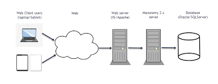
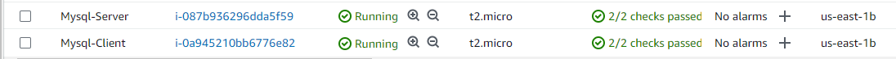
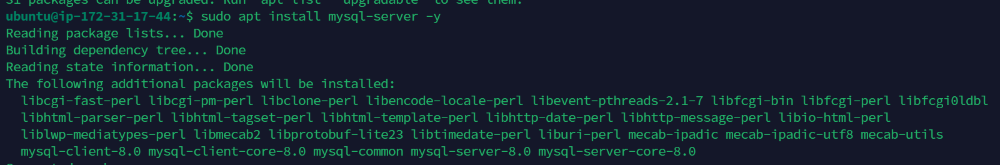
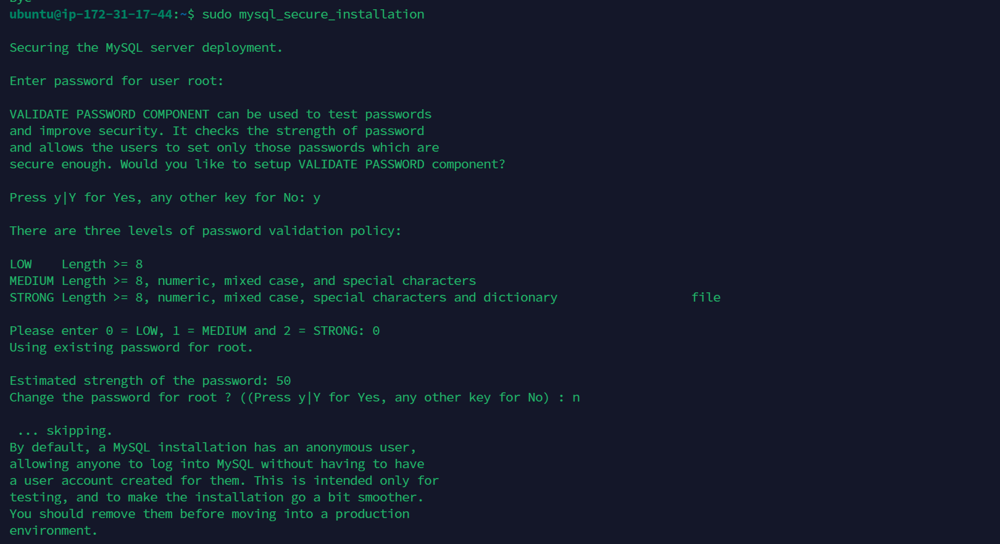
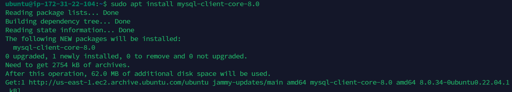
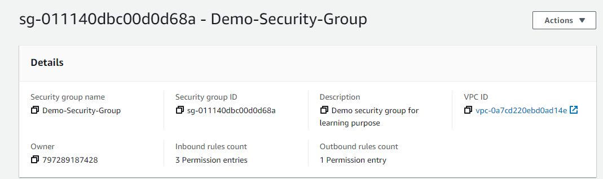
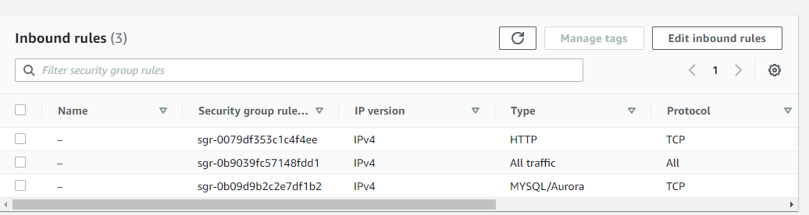
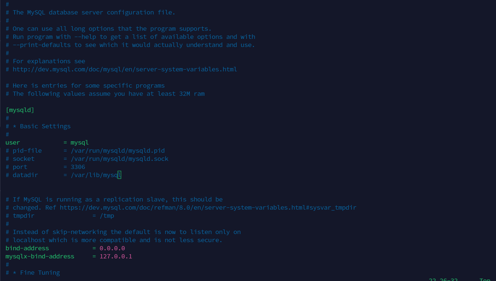
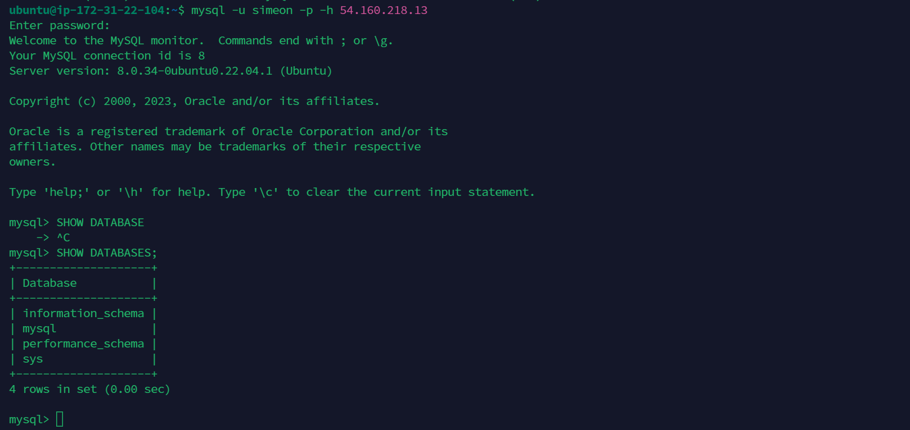

# Understanding Client-Server Architecture 

## Client-Server Architecture with MYSQL 

Client-Server refers to an architecture in which two or more computers are connected together over a network to send and receive request between one another 

The machine sending the request is usually refered to as the CLIENT and the machine responding to the request is called the SERVER 

A simple diagram of web server architecture is presented below. 

In the example above, a machine that is trying to access a web site using web browsers as the client. It sends HTTP request to a web server (Apache, Nginx, IIS etc) over the internet 

if we extend this concept further and add Database Server to our architecture, we can get this picture : 

Assuming that typed www.propitixhome.com on your browser, it means your browser is considered as the client. Essentially, it is sending request to the remote server and in turn, would be expecting some kind of response from the server. 

Lets take a quick example and see Client-Server communication in action. 

I will be running this command using Ubuntu terminal 

Open your ubuntu or window terminal and run the curl command 

<button class="button" type="submit">Copy Below Code</button>

#### curl -IV www.propitixhomes.com

Note: If your ubuntu does not have "curl" you can install it by running 

#### sudo apt install curl

In this example, your terminal will be the client while www.propitixhomes.com will be the server.

Below is the response from the remote server. You can also see that the request from the url is been served by a computer with IP Address 75.2.115.196:80.... on port 80.

Another simple way to get a server IP address is to use a simple diagnostic tool link 'ping'. It will also show round-trip time - time packets to go to and back from the server. This tool uses [ICMP Protocol](https://en.wikipedia.org/wiki/Internet_Control_Message_Protocol)

Recommendation for self study 

1. Study about [PING](https://en.wikipedia.org/wiki/Ping_(networking_utility)) and [TRACEROUTE](https://en.wikipedia.org/wiki/Traceroute) network diagnostic utilities. 

2. Refresh your knowledge of [BASIC SQL COMMANDS](https://www.w3schools.com/sql/) and  perform simple task like CREATE, SHOW, DROP SELECT, etc

# Implement a Client Server Architecture using MYSQL Database Management System (DBMS).

To implement the above we have to create two instances of EC2 in AWS 

Follow the below steps 

1. Create and configure two Linux based virtual server (EC2) Instances in AWS 

2. On the msql-server install MYSQL Server Software 

Read more about [MYSQL](https://www.mysql.com/)

3. On the mysql-client server install Mysql Client software 

4. By default, both of your EC2 virtual servers are located in the same local virtual network, so they can communicate to each other using local IP addresses. 

Use mysql-server's local IP address to connect from client. MYSQL server uses TCP port 3306 by default, so you will have to open it by creating a new entry in inbound rule in mysql-server security group. 

Note : For extral security do not allow all IP addresses to reach your msql-server, allow only specific local IP address of your msql-client 

You might need to configure MYSQL server to allow connections from remote host 

<button class="button" type="submit">Copy Below Code</button>

#### sudo vi /etc/mysql/mysql.config.d/mysqld.config

Replace 127.0.0.1 to 0.0.0.0 

6. From mysql-client connect remotely to mysql-server Database engine without using ssh. you must use mysql utility to perform this action. 

Follow this step to perfom the action 

* Create a MySQL User for Remote Access, first you need to login 

#### mysql -u root -p

Run the query below

<button class="button" type="submit">Copy Below Code</button>

CREATE USER 'your_user'@'%' IDENTIFIED BY 'your_password';
GRANT ALL PRIVILEGES ON *.* TO 'your_user'@'%' WITH GRANT OPTION;
FLUSH PRIVILEGES;
EXIT;

Log in using the command below 

<button class="button" type="submit">Copy Below Code</button>
#### mysql -u your_user -p -h your-ec2-public-ip

7. Check that you have successfully connected to a remote MYSQL server and can perform sql queries 

<button class="button" type="submit">Copy Below Code</button>

#### show database

