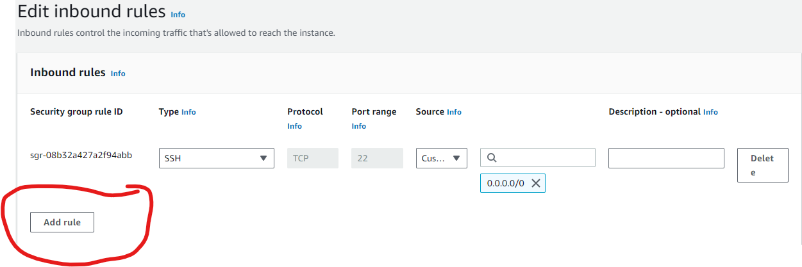
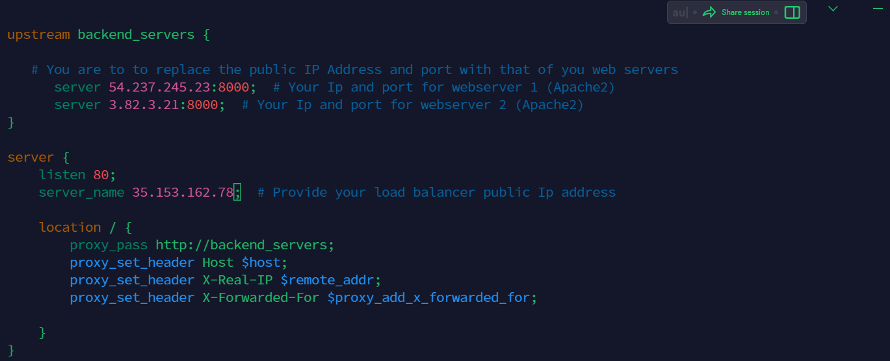

# Implementing Load Balancers with Nginx

Discover the art of load balancing with Nginx in this projet. I will implement how to distribute traffic efficiently across multiple servers, optimize performance and ensure high availability of our web applications 

## Introduction to Load Balancing and Nginx 

### What is load balancing?

Load balancing is the process of distributing a set of tasks over a set of resources (computing units), with the aim of making their overall processing more efficient. Load balancing can optimize the response time and avoid unevenly overloading some compute nodes while other compute nodes are left idle. Read more about [Load Balancing](https://www.nginx.com/resources/glossary/load-balancing/)

Load balancing simply put is like having a team of helpers working together to make sure a big job gets done smoothly and efficiently.

Example : Lets say you have a web set of web-servers serving your application. In order to distribute the traffic evenly between the web-servers, a load balancer is deployed. The load balancer stands in front of the web-servers, all the traffic gets to it first. it then distributes the traffic across the set of web-servers. This is to ensure no web-server get over worked, consequently improving system performance.

### What is Nginx

NGINX is open source software for web serving, reverse proxying, caching, load balancing, media streaming, and more. It started out as a web server designed for maximum performance and stability. In addition to its HTTP server capabilities, NGINX can also function as a proxy server for email (IMAP, POP3, and SMTP) and a reverse proxy and load balancer for HTTP, TCP, and UDP servers.

Nginx is a versatile software, All that is needed is to configure it properly to serve your case. 

In this project i will be showing how to configure Nginx as a load balancer 

## Setting Up a Basic Load Balancer 

We are going to be provisioning two AWS EC2 instances running ubuntu 22.04 LTS and install Apache webserver in the first instance and Nginx webserver in the second instance. We will open port 8000 to allow traffic from anywhere and update the default page of the web servers to display their public Ip address. 

Follow the steps below..........

1: Provisioning EC2 Instance 

* Open your AWS Management Console, click on EC2, Scroll down and click on Launch instance.

* Under Name, provide a unique name for each of your webservers 

* Under Application and OS images, click on quick start and click on ubuntu 

* Under Key Pair, click on create new key pair or you can use an existing one if you have. you can use the same key pair for more than one instances 

* Under Network settings, select Create security group. You can also choose to use an existing security group.

* Finally click on launch instance

2: Open Port 8000

We will be running our webservers on port 8000 while the load balancers run on port 80. We need to open port 8000 to allow traffic from anywhere. To do this we will modify our security group and add rules to each of the webservers.

* Click on instance ID to get details of your EC2 instance 

* On the same page, scroll down and click on security group 

* On the top of the page, click on Action and select Edit inbound rules or scroll down and click on Edit inbound rules

* Add Rules (How you want user to access you application)

3: Install Apache Webserver

After provisioning both our servers and have opened the necessary ports, its time to install Apache software. To do so we must first connect to each of the webserver via ssh. Then we can now run the command on the terminal of our webserver.

* Open your terminal in your local machine, and connect via ssh. 

I will be connecting with a tool called [Termius](https://termius.com/download/windows) to connect via ssh.

* Next install apache with the command below 

* Verify that apache is running using the command below

4: Configure Apache to serve a page showing its public IP

Now let's configure Apache webserver to serve content on port 8000 instead of it default port port 80, then create an index.html file that will contain the code to display the public IP of the EC2 instance, we will then override apache webserver's default html file with the new index.html file. 

* Configuring Apache to serve content on port 8000:

1. Using your text editor (eg vi, nano) open the file /etc/apache2/ports.conf

2. Add a new Listen directive for port 8000: First type i to switch the editor to insert mode, then add the listen directive and save file.

3. Next open the file /etc/apache2/sites-available/000-default.conf and change port 80 on the virtualhost to 8000 like the screenshot below:

4. Close the file by first pressing the esc key on your keyboard then the command below: 

5. Restart apache to load the configuration using the command below:

* Creating our new html file: 

1. Open a new index.html file with the command below:

2. Switch vi editor to insert mode and paste the html file below. Before pasting the html, get the public public IP of your EC2 instance from AWS Management Console and replace the placeholder text for IP address in the html file.

3. Change the ownership of the index.html file with the command below

* Overide the default html file of Apache webserver:

1. Replace the default html file with the new html file using the command below

2. Restart webserver to load the configuration using the command below: 

3. Copy and paste your public IP address on your browser, and you should see a page like this

5: Configuring Nginx as a load balancer 

* Provision a new EC2 instance running ubuntu 22.04. Make sure port 80 is opened to accep traffic from anywhere

* SSH into the instance 

* Install Nginx into the instance using the command below 

* Verify that Nginx is installed with the command below 

* Open Nginx configuration file with with the command below. Note that this file does not exist by default, vim will create the file.

* Paste the configuration file below to configure nginx to act like a load balancer. Copy the code below and modify. Make sure you provide neccessary 

Explanation : 

upstream backend_servers : Thia defines a group of backend servers. The server lines inside the upstream block list the the Ip addresses and ports of your backend servers.

proxy_pass inside the location block sets up the load balancing, passing the requests to the backend servers. 

The proxy_set_header lines pass neccessary headers to the backend server=s to correctly handle the requests.

* Test your configuration 

* If there are no errors, restart Nginx to load the new configuration with the command below 

* Paste the public IP address of Nginx load balancer, you should see the same webpages served by the server 

## Load Balancing Algorithms 

Load balancer algorithms are techniques used to distribute incoming network traffic or workload across multiple servers, ensuring efficient utilization of resources and improving overall system performance, reliability, and availability. Here are some common load balancer algorithms 

1. Round Robin: This algorithm distributes requests sequentially to each server in the pool. It is simple to implement and ensures an even distribution of traffic. It works well when all servers have similar capabilities and resources.

2. Least Connections: This algorithm routes new requests to the server with the number of active connections. It is effective when servers have varying capacities or workloads, as it helps distribute traffic to the least busy server. 

3. Weighted Round Robin: Similar to the Round Robin algorithm, servers are assigned different weight based on their capabilities. Servers with higher capacity receives more requests. This approach is useful when servers have varying capacities or performance levels. 

4. Weighted Least Connections: Similar to the Least Connections algorithm, but servers are assigned different weight based on their capabilities. Servers with higher capacities recieve more connections. This approach is balances traffic based on server capacities.

5. IP Hash: This algorithm uses a hash function based on the clients IP address to consistently map the client to a specific server. This ensures that the same client aways reaches the same server, which can be helpful rof maintaining session data or stateful connection.

## SSL Termination and HTTPS Load Balancing 

We can cnfigure TLS/SSL on our website, but we need to understand the purpose of TLS certificate, how they work and the technology behide it.

### Encryption

Encryption is at the heart of TLS/SSL. 

Encryption is the process of converting plain, readable data (refered to as plaintext) into an unreadable format called ciphertext. The purpose of encryption is to ensure data confidentiality and protect sensitive information from unauthorized access or interception.

In encrption, an algorithm (known as a crptographic algorithm) and a secret key is used to transform the plain text into ciphertext. Only those who possess the correct encrption key can decrypt

### Type of Encryption

Encryption can be classified into several types based on various criteria, such as the encryption process, the key used, and the level of security provided. Here are some common types of encryption:

#### 1. Symmetric Encryption 

Symmetric encryption, the same key is used for both encryption and decryption processes. Both the sender and the receiver must posses the shared secret key. While encryption is generally faster than other method, distributing and managing the secret key securedly among all parties can be challenging. Examples of symmetric encryption algorithms include Advanced Encryption Standard (AES) and Data Encryption Standard (DES)

#### 2. Asymmetric Encryption

Asymmetric encryption (Public-Key Encryption) Asymmetric encryption uses public key and private key. The public key is used for encryption, while the private key is used for decryption. Anyone can use the recipient6's public key to encrypt data, but only the recipient with the matching private key can decrypt and read the data. This method eliminates the need for secure key distribution but is computationally more intensive than symmetric encryption.

popular asymmetric encryption algorithms include RSA (Rivest-Shamir-Adleman) and Elliptic Curve Cryptography (ECC). 

#### 3. Hybrid Encryption

Hybrid encryption combines both symmetric and asymmetric encryption. In this approach, the sender generates a random symmtric key for each message and encrypts the actual data using this symmetric key (which is efficient for large amount of data). Then, the sender encrypts the symmetric key using the recipient's public and sends both the encryted data and the encrypted symmetric key to the recipient. The recipient can decrypt the symmetric key using their private key and then use the symmetric key to decrypt the actual data. This method leverages the advantages of both symmetric and asymmetric encryption.

### The Purpose of TLS/SSL Certificate

The main purpose of TLS/SSL certificates is to encrypt the data transmitted between the web server and the client. This ensures that sensitive information, such as login credentials, personal data, or credit card details remain confidential and protected from eavesdropping

A secondary benefit is to establish trust between webservers and their client. Before data is transmitted between client and server, the server needs to go through the process of authentication (server proves that its identity is genuine) by presenting its certificate to the client which is validated by a trusted certificate authority (CA).

### How TLS/SSL Work

TLS/SSL works with hybrid encryption, this means that both symmetric and asymmetric encryption is used in TLS/SSL

Before data is transmitted between client and server, the process of TLS Handshakes is carried out.

During TLS handshake, the server shares with the client its digital certificate. The digital certificate contains the public key of the server.

The client (browser) verifies the validity of the server public key of the Certificate Authority CA. If valid, the client encrypts it encryption key using the server's public key. This encrypted key is then sent to the server.

The client generates its encryptionkey using symmetric encryption. The implication is that its uses the same key for both encryption and decryption hence the need to encrypt its key using the server public key. 

Since the server is the only entity in possession of its private key, it is able to decrypt the clients encrypted key.

After the handshake process is completed, the client encrypts every data it sends to the server. The server is then able to decrypt the data with the client's encrypted key.

This ensures that only the server is able to make sense of the data shared by the client.

## Advanced Load Balacing Features

Advanced features of load balancing enhance the capabilities and efficiency of load balancers in handling complex scenarios and optimizing application performance. Here are some key advance features 

#### 1. SSL Offloading/Termination

Load balancers can handle Secured Socket Layer (SSL) encryptionand decryption on behalf of backend servers. This offloading reduces the computational burden on application servers, enabling them to focus on processingaplication logic instead of handling SSL/TLS encryption.

#### 2. Session Persistence/Sticky Sessions

Some applications require that a client's requests consistently go to the same backend servers, to maintain session state. Load balancers can use techniques like cookie-based or IP-based persistence to ensure requests from a specific client are directed to the same server throughout the session. 

#### 3. Health Checks and Automatic Server Failover

Load balancers can perform periodic health checks on the backend server to monitor their availability and performance. If a server becomes unresponsive or unhealthy, the load balancer can automatically remove it from the server pool, routing traffic to healthy servers, thus ensuring high availability. 

#### 4. Global Server Load Balancing (GSLB)

GSLB enables load balancing across multiple data centers or geographically distributed server clusters. It helps direct trafficto the nearest or most available data center, optimizing user experience and providing recovery capabilities.

#### 5. Application-Layer Load Balancing

Advanced load balancers can make routing decisions based on application-specific attributes beyond traditional IP and TCP/UDC information. For example, they can inspect HTTP headers or application-layer protocols to direct traffic based on content, URL or user agent.

#### 6.  Dynamic Load Balancing 

Some load balancers use real-time analytics and machine learning to dynamically adjust server weights or routing decisions based on current server performance, network conditions, and application demand. This adaptability ensures efficient resource utilization.

#### 7. Anycast Load Balancing

Anycast allows multiple load balancer instances to share the same IP address across different locations. When a client sends a request, it is automatically routed to the nearest dload balancer instance, reducing latency and improving performance. 

#### 8. Rate Limiting and Traffic Shaping

Load balancers can enforce rate limits on incoming requests from clients, preventing denial of service attacks and controlling resource utilization. They can also shape traffic, prioritizing certain types of requests over others based on defined policies.

#### 9. Web Application Firewall (WAF) Integration 

Some load balancers offer integrated WAF functionality to protect web applications from common security threats like SQL injection, cross-site scripting (XSS), and other vulnerabilities.

These advanced features make load balancers powerful tools for optimizing application performance, ensuring high availability, and protecting applications from variuos threats and failures. They are essential components in modern, scalable, and robust IT infrastructures.

### THANK YOU.  

