# Automating Load Balancer Configuration With Shell Scripting

Streamliine your load balancer with ease using shell scripting and CICD on Jenkins

This project demonstrate how to automate the setup and maintenance of your load balancer using a freestyle job, enhancing efficiency and reducing manual effort. 

## Automate the deployment of webservers

We will automate the entire process, we will do that by writing a shell script that when ran, all that we would have manually do will be do automatically. Automation helps to speed up the deployment of services and reduce the chances of making errors. 

## Deploying and Configuring the Webservers 

All the process we need to deploy our webservers has been codified in the shell script below: 

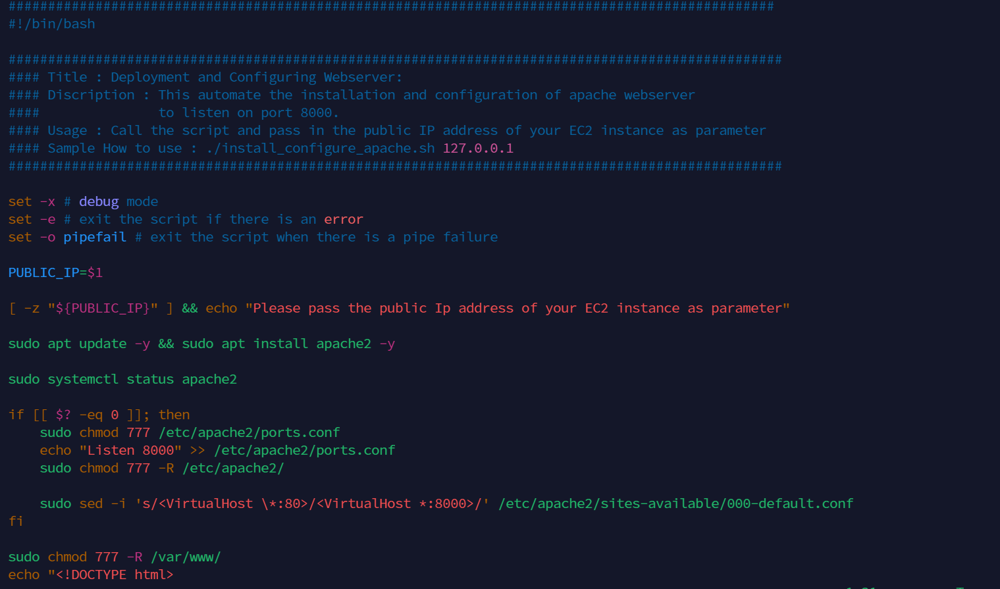
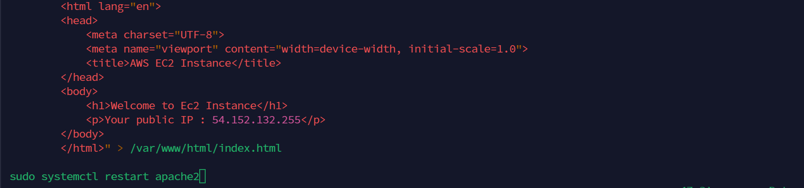

Follow the steps below to run the script: 

Step 1: Provision an EC2 instance running ubuntu 22.04 

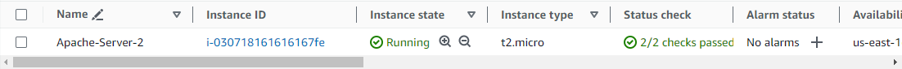

Step 2: Open port 8000 to allow traffic from anywhere using the security group 

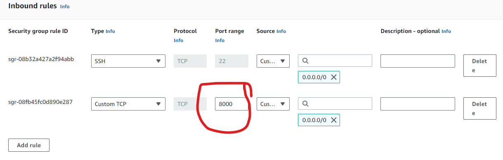

Step 3: Connect to the webserver via the terminal using SSH

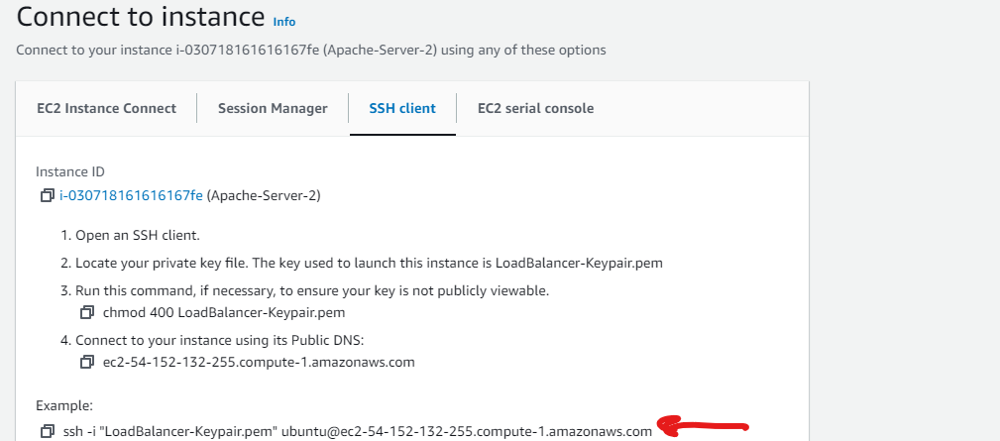

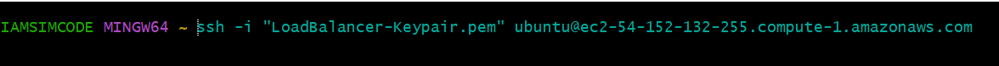

Step 4: Create a file, open in your code editor and paste the script above, save and close the code editor

Save the file and exit...

Step 5: Change the permission on the file to make it an executable using the command below

Step 6: Run the shell script using the command below 

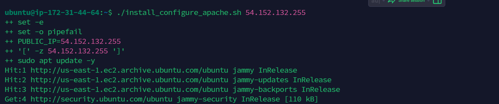

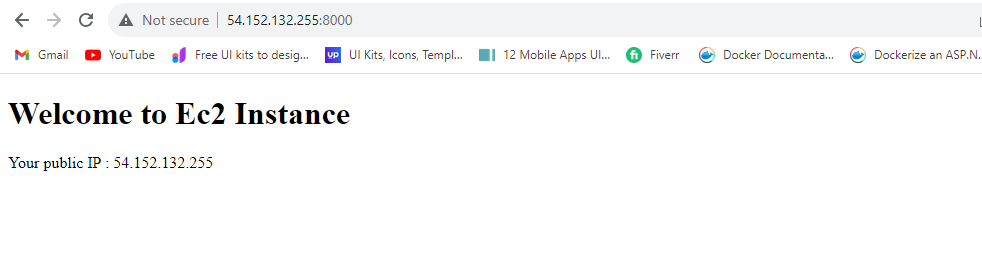

# Deployment of Nginx as a Load Balancer Using Shell Script

## Automate the Deployment of Nginx as a Load Balancer Using Shell Script 

Having successfully deployed and configured two webservers, we will move on to the load balancer.

Provision an EC2 instance running ubuntu 22.04, open port 80 to anywhere using the security group and connect to the load balancer via the terminal. 

All the steps to implement Load Balancer with Nginx has been codified in the script below:

Read the instructions carefully in the script to learn how to use the script 

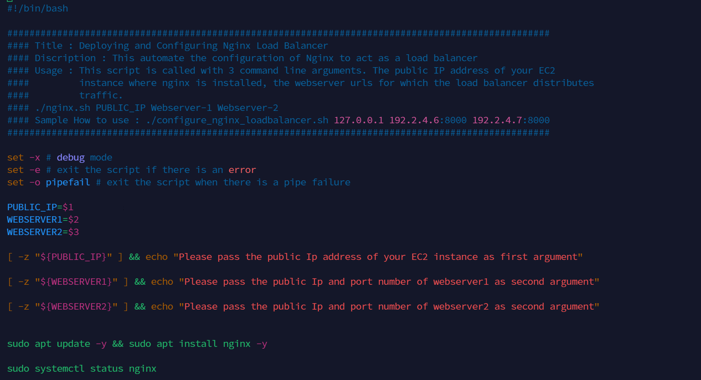
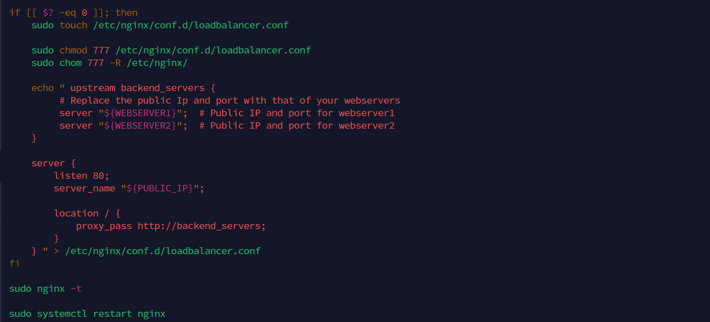

### Steps to run the shell script 

1. On your terminal, open a file nginx.sh using the command below 

2. Copy and paste the script above inside the file

3. Close the file using the command below 

4. Change the file permisssion to make it an executable using the command below 

5. Run the script with the command below 

### Verifying the setup 

#### WEBSERVER1

#### WEBSERVER2

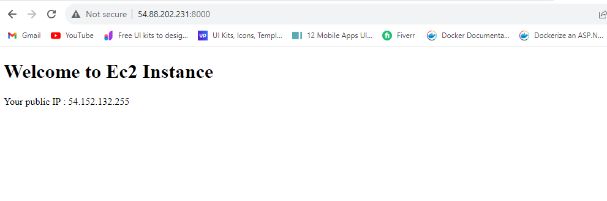

#### LOADBALANCER

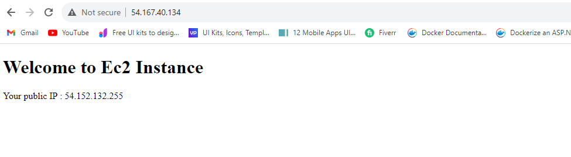

#### THANK YOU!

