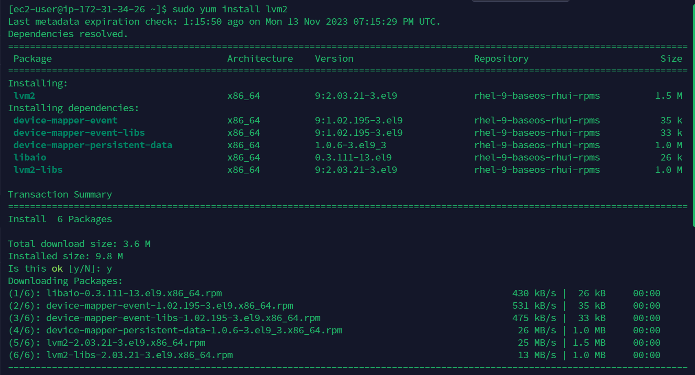
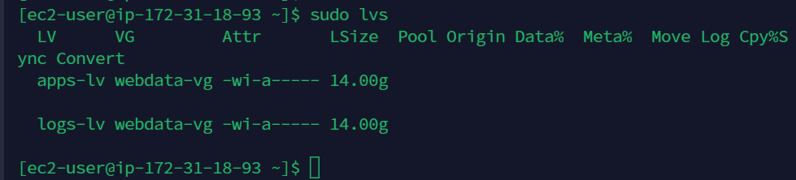
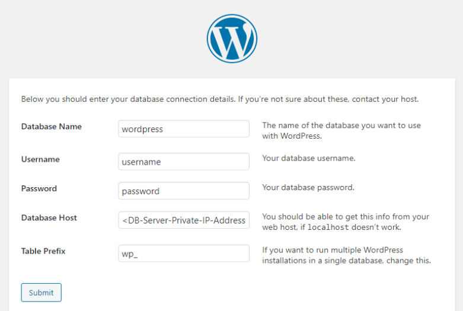

# Implementing Wordpress Website With LVM Storage Management

## Understanding 3 Tier Architecture Web Solution With WordPress

As a Devops engineer, you will most probably encounter [PHP](https://www.php.net/) based solutions. It is a dominant web programming language used by websites than any other programming language.

In this project i will prepare storage infrastructure on two Linux servers and implement a basic web solution using [WORDPRESS](https://en.wikipedia.org/wiki/WordPress).

WordPress is a free and open source content management system written in PHP ans paired with MYSQL or MariaDB as its backend Relational Database Management System(RDMS)

This project consist of two parts 

1. Configure storage subsystem for Web and Databased server based on Linux OS. This will give you practical understanding about working with disks, partitions and volumes in Linux. 

2. Install wordpress and connect it to a remote MySQL database server. This will solidify your skills of deploying web and DB tiers of web solution.

As a DevOps Engineer, your deep understanding of core components of web solutions and ability to troubleshoot them will play essential role.

Three-tier Architecture

Generally, web or mobile solutions are implemented based on what is called the three-tier Architecture.

Three-tier Architecture is a client server software pattern that is comprise of 3 seerate layers. 

1. Presentation Layer : This is the user interface such as the client server or browser on your laptop. 

2. Business Layer : This is the backend program that implements business logic. (Application or Web server)

3. Data Access or Management Layer : This is the layer for computer data storage and data access. [Database Server](https://www.computerhope.com/jargon/d/database-server.htm) or File System Server such as [FTP Server](https://www.wftpserver.com/) or [NFS Server](https://www.techtarget.com/searchenterprisedesktop/definition/Network-File-System)

We will showcase three-tier Architecture while ensuring that the disk used to store files on the Linux server are adequately partitioned and managed with programs such as GDISK and LVM respectively 

### My Three-tier SetUp.....

1. A Laptop or PC to serve as client 
2. An EC2 Linux Server as a web server (I will install Wordpress here)
3. An EC2 Linux Server as a database(DB) Server 

Note : For this project i will use a very popular linux distribution called [RedHat](https://www.redhat.com/en), it also has a fully compatible derivative - [CentOS](https://www.centos.org/)

Important! : For ubuntu server, when connecting to it via SSH or Putty, or any other tools, we use ubuntu as the user, but for RedHat our use will be ec2-user. Conecting string will look like this ec2-user@<Public-IP>

## Implementing LVM on Linux Servers (Web and Database Servers)

LVM : Logical Volume Manager

Step 1 - Prepare a web server

1. Launch an EC2 instance that will serve a "Web Server". Create three volumes in the same AZ as your web server, each of 10GIB. 

Learn how to add EBS volume to an EC2 instance [here](https://www.youtube.com/watch?v=HPXnXkBzIHw)

-----------------------------------------------------------------------------------------------------------------------------------

2. Attach all three volumes one by one to your web ser ver EC2 instance

Open up Linux terminal to begin configuration 

3. Use [lsblk](https://man7.org/linux/man-pages/man8/lsblk.8.html) command to inspect what block devices are attached to the server. 

Notice names of my newly created devices. All devices in linux reside in /dev/directory

You can inspect it [ls /dev/]() and make sure you see all three newly created block devices there. their names will be like [xvdf, xvdh, xvdg]() . 

4. Use [df -h]() Command to see all mounts and free spaces on your server

5. Use [gdisk]() utility to create a single partition on each of the three disks

Install [lvm2]() package, copy the below code 

6. Run the below command to check available partitions

7. Use pvcreate utility to make each 3 disk a physical volumes (PVs) to be used by LVM (logical vovlume management)

8. Verify that your physical volume has been created successfully by running the command below 

9. Use vgcreate utility to add all 3 PVs to a volume group (VG) Name the VG. Here i will name it webdata-vg

10. Verify that your VG has been created successfully by running the command below 

11. Use lvcreate utility to create 2 logical volumes. app-lv(Use half of the PV size), and logs-lv (use the remaining space of the PV size).

Note: app-lv will be used to store data for the website, while logs-lv will be used to store data for logs.

12. Verify that your Logical Volume has been created successfully by running the command below

13. Verify the entire setup: Run the code below 

14. Use the command below to format the logical volumes with ext4 filesystem 

15. Create /var/www/html directory to store website files 

16. Create home/recovery/logs to store backup of log data

17. Mount /var/www/html on appa-lv logical volume

18. Use rsync utility to backup all the files in the log directory /var/log into /home/recovery/logs.

Note : This is required before mounting the file system. 

19. Mount /var/log on logs-lv logical volume

Note : All the existing data on /var/log will be deleted, that is why step 15 above is very important 

20. Restore log files back into  /var/log directory 

21. Update /etc/fstab file so that the mount configuration will persist after restart of the server.

The UUID of the will be used to update /etc/fstab file

Open fstab file in any text editor of your choice 

Update /etc/fstab in this format using your own UUID and remember to remove the leading and ending quotes.

22. Test the configuration and reload the daemon

23. Verify your setup is running. copy the code below and ensure you get this output 

## Installing Wordpress and Configure to use MySQL Database

Step-2 - Preparing Database Server 

Launch a second RedHat EC2 instance that will have a role - DB Server. Repeat the same steps as for the Web Server, but instead of apps-lv create db-lv and mount it to /db directory instead of /var/www/html/

Step-3

### Install Wordpress on your EC2 Web Server

1. Update the Repository 

2. Install wget, Apache and its dependencies 

3. Start Apache

4. To install PHP and its dependencies 

5. Restart Apache

6. Download wordpress and copy wordpress to /var/www/html

7. Configure SELinux Policies 

Step-4 
### Installing MYSQL on your DB Server 

Verify that the service is up and running by using 

#### sudo systemctl status mysqld

if its not running, restart the service and enable it so it will be running even after reboot.

Step-5 
### Configure DB to work with Wordpress

Step-6 
### Configure Wordpress to connect to remote database 

Hint: Do not forget to open MYSQL port 3306 on DB Server EC2.

For extra security, you security, you shall allow access to the DB Server only from your web server's Ip address, so in the inbound rule configuration specify source as /32

1. Install MYSQL client and test that you can connect from your web server to your DB Server using mysql-client

#### sudo yum install mysql

#### sudo mysql -u admin -p -h < DB-Server-IP-Address>

2. Verify if you can successfully execute 

3. Change permission and configuration so Apache could use Wordpress

4. Enable TCP port 80 in inbound rules configuration for your web-server and enable every where

5. Try to access from your browser the link to your wordpress 

#### http://< web-server-public-ip-address>/wordpress

Thank you for reading 

